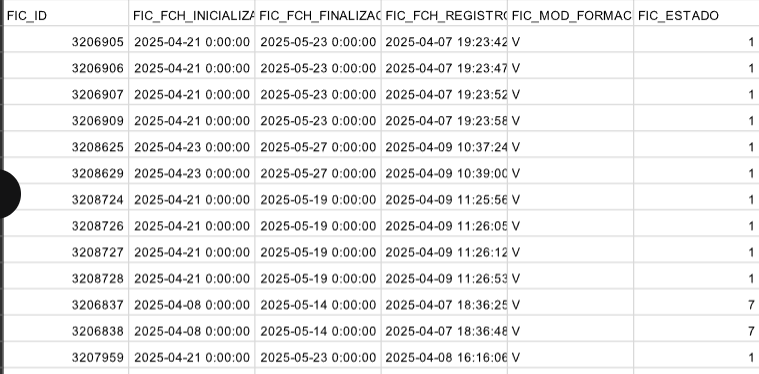
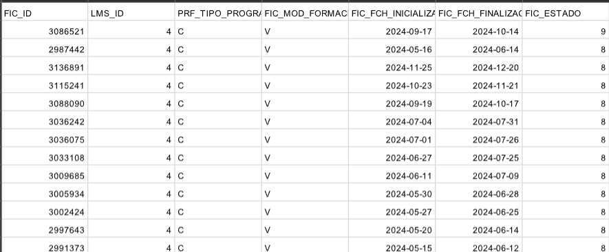
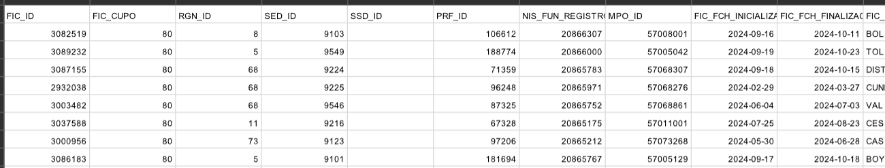
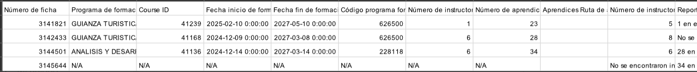
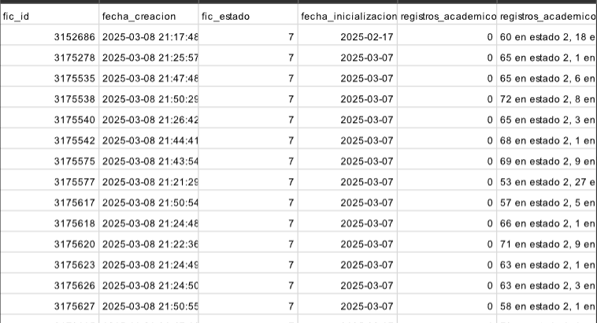

# ExcelReport

Reporte 2-Novedad fichas nuevas (Oracle)

Reporte 4- información básica de fichas (Oracle)

Reporte 5- toda la información de las fichas postgres (Postrges)

**Reporte 6 -reporte de catalina (Postrges)**

cambiar el nombre del archivo de la constante **GENERAL_REPORT_ARCHIVE** que está dentro de la clase  ReportProcess.
En el archivo csv que se va a leer debe tener la columna FIC_ID.

python script.py --type_report=6

**Reporte 7-fichas sin registros académicos postgres (Postrges)**

